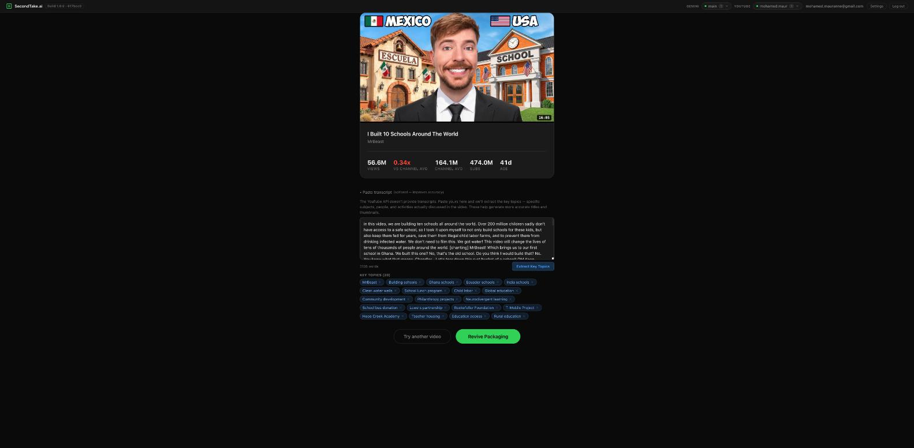
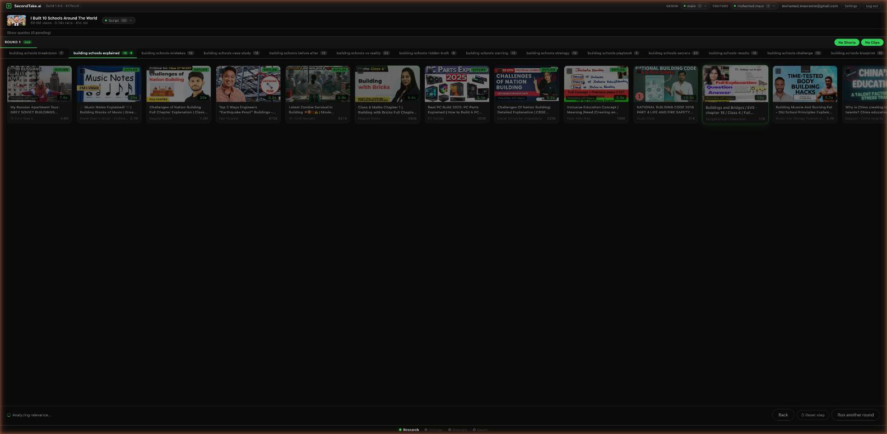
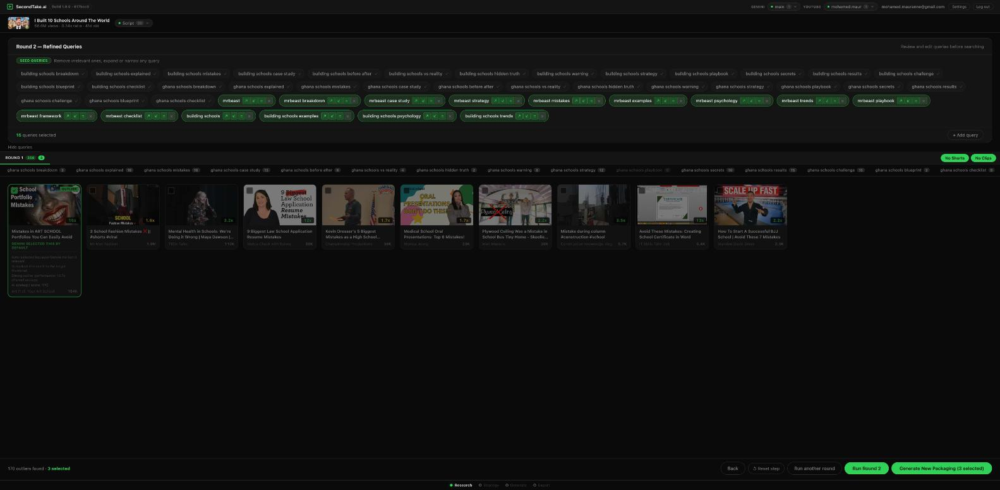
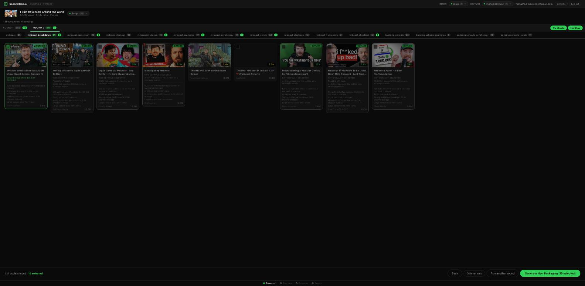
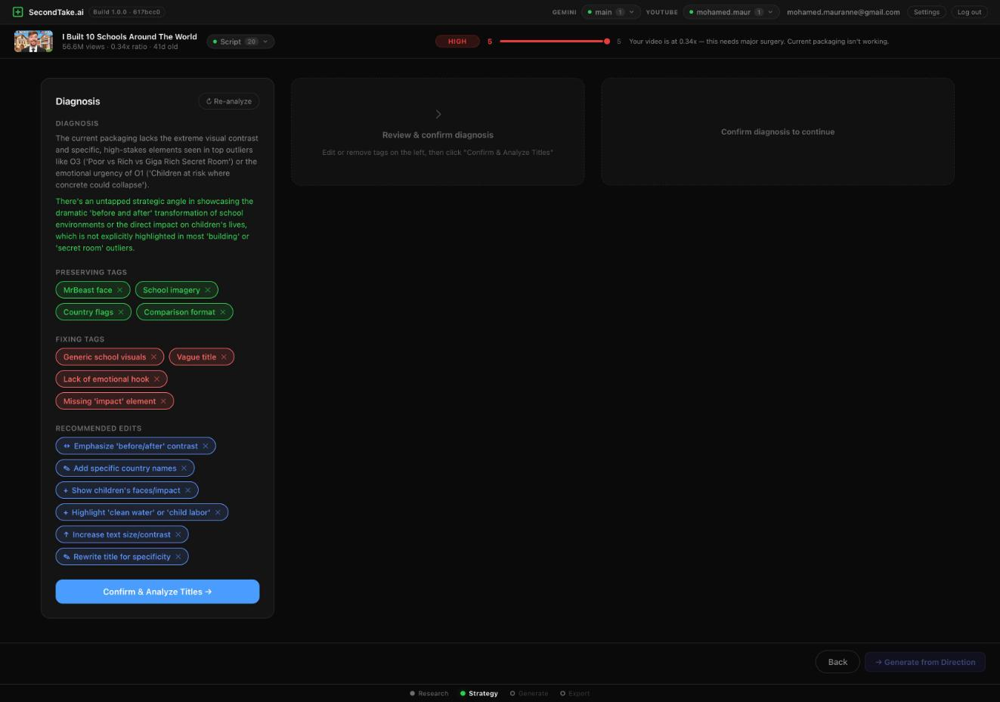
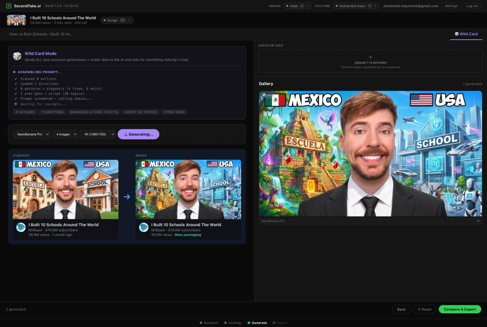

# SecondTake.ai (Packaging Reviver)

> Rescue flopped videos with data-backed redesign. Paste a YouTube link → extract transcript + key topics → Snowball research finds what wins in that niche → AI scores outlier relevance → vision analysis identifies thumbnail patterns → generates packaging directions with new titles and thumbnail concepts → side-by-side comparison with CTR prediction.

## Screenshots

### Home — Paste a YouTube URL


Paste a link and hit Revive Packaging. Your saved flops appear at the bottom — pick up where you left off. API keys are managed server-side after a one-time setup in Settings.

### Video Analysis — Performance Stats


Pulls video stats from YouTube API. Shows views, channel average multiplier (0.34x here — this video got 34% of the channel's average), subscriber count, and age. The multiplier tells you instantly whether the packaging actually underperformed.

### Transcript + Key Topic Extraction


Paste the transcript and Gemini extracts 20 key topics — specific subjects, people, and activities discussed in the video. These feed directly into the seed query generation, making the Snowball research phase dramatically more targeted than title-only analysis.

### Seed Queries — Script-Informed Research


Gemini generates 30 seed queries by analyzing the title, description, and key topics from the transcript. Each query has expand/narrow/similar controls. The green "Script 20" badge confirms transcript data is being used. Remove irrelevant ones, expand promising angles, or add your own before running Round 1.

### Round 1 — Outlier Results


Snowball research runs all seed queries against YouTube. Results show outlier videos with multiplier badges (7.5x, 25x, 20x — how many times above their channel average). Filter by No Shorts, No Clips. Each query tab shows its result count. Gemini analyzes each outlier's relevance to your video — both topical and visual.

### Round 2 — Snowball Refined Queries


The snowball effect: Round 1 winners generate Round 2 queries. Gray queries are from Round 1, green are new refined queries from the snowball (mrbeast breakdown, mrbeast case study, mrbeast strategy, building school examples, building schools psychology). This is where the research narrows from broad to surgical.

### Round 2 — Results with Relevance Analysis


Round 2 outliers with full relevance analysis. Each card shows: thumbnail, multiplier, channel name, view count, and Gemini's relevance reasoning — why it was selected or rejected, topical match, and visual composition notes. 327 outliers found across both rounds, 20 selected for packaging generation.

### Strategy — Diagnosis


AI diagnosis based on the Change Dial (HIGH = 0.34x means major surgery needed). Three tag categories:

- **Preserving tags** (green): What's already working — MrBeast face, school imagery, global flags, country names.
- **Fixing tags** (red): What needs fixing — generic school visuals, vague title, missing emotional hook, lack of specific impact.
- **Recommended edits** (blue): Specific changes — thumbnail show 'before' state, add child labor visual, emphasize 'clean water', title add specific impact, reduce MrBeast size.

All tags are editable. Confirm to move to title analysis.

### Title Analysis + Packaging Directions


Detects outlier title patterns, generates new title variations, and creates packaging directions — each with a new title, reference thumbnails from outliers, and specific visual edit instructions calibrated by the Change Dial.

### Recommended Directions with Reference Thumbnails


Each direction comes with thumbnail reference images from the outliers and specific visual instructions.

### Direction Tabs — Generate New Thumbnails


Each title direction gets its own tab. Select references, hit Generate, and Gemini creates a new thumbnail informed by the edit directions, the Change Dial intensity, and the outlier visual patterns.

### Generated Thumbnail with Gallery


Generated thumbnail appears alongside the original. Compare the "before" reference against the "latest" generation. Every iteration is saved — you can revert or compare versions.

### Wild Card Mode


Wild Card sends ALL previous generations + outlier data to the AI and asks for something nobody's tried. It assembles context from scanned outliers, loaded directions, diagnosis tags, script topics, and previous generations — then generates 4 completely new concepts in a single batch.


Wild Card results show Current vs Remix side-by-side with the latest generation in the gallery. Each wild card gets a unique concept name. Previous attempts are tracked so each batch builds on what came before.

### Compare & Export — Original vs New Packaging


Side-by-side comparison of original and new packaging. Filter by Direction or Wild Card. Vision model scores each new thumbnail on 8 dimensions (market size, difficulty, negative angle, readability, emotion, contrast, curiosity gap, composition) and predicts CTR improvement.


Export as Thumbnail, Mockup, or Before & After.

### Before & After


---

## Try It

**Live app:** [secondtakeai.netlify.app](https://secondtakeai.netlify.app)

The app is free to use but runs on your own API keys. After signing in with a magic link, go to Settings and add:

1. **Gemini API key** — Go to [Google AI Studio](https://aistudio.google.com/apikey) and create a key. Used for diagnosis, title generation, packaging directions, thumbnail generation, and relevance scoring. Free tier is generous.

2. **YouTube Data API v3 key** — Go to [Google Cloud Console](https://console.cloud.google.com/apis/credentials), create a project, enable the YouTube Data API v3, and generate an API key. Used to pull video stats and find outliers. Free tier gives you 10,000 quota units/day.

Your keys are encrypted server-side (AES-256-GCM) before storage. They never touch the frontend.

---

## Why This Exists

Video packaging — title, thumbnail, hooks — is responsible for 80% of view count variance. A video that flopped isn't always bad content; it's often bad packaging.

This is the third evolution of the research-and-generate tools. **Version 1** was a monolithic HTML file (YouTube Outlier Research). **Version 2** added thumbnail generation (Thumbnail Studio). **Version 3** (this) unified them into a proper SvelteKit app with server-side key management, type-safe state, and a clear 4-screen user journey: Research → Strategy → Generate → Export.

The pipeline: paste a flopped video → add transcript for deeper topic extraction → Snowball research finds what wins in that niche → Gemini scores each outlier for topical and visual relevance → vision analysis identifies winning thumbnail patterns → diagnosis flags what's working vs what's broken → Change Dial calibrates edit intensity based on underperformance ratio → generates packaging directions with new titles and surgical thumbnail concepts → Gemini generates new thumbnails → side-by-side comparison with CTR prediction.

Instead of guessing what to change, creators get data-backed direction: "Show the before state", "Add child labor visual for emotional hook", "Reduce MrBeast size to 30% and emphasize the school transformation."

## Technical Architecture

### Stack

| Layer | Tech |
|-------|------|
| **Frontend** | SvelteKit with Svelte 5 runes + TypeScript |
| **Backend** | Netlify Edge Functions (SvelteKit server routes) |
| **Database** | Neon PostgreSQL (projects, research cache, iterations, channel stats) |
| **AI Text** | Gemini 2.5 Flash (seed queries, title generation, relevance scoring) |
| **AI Image Gen** | Gemini 2.0 (thumbnail generation) |
| **AI Vision** | Gemini Multimodal (pattern extraction, CTR scoring, outlier relevance) |
| **Image Processing** | @imgly/background-removal (WASM, client-side) |
| **Auth** | Magic-link passwordless (JWT + HttpOnly cookies) |
| **Encryption** | AES-256-GCM for API keys at rest |
| **Persistence** | IndexedDB (local binary cache) + Neon (persistent metadata + versions) |

### Data Flow

```
User pastes flopped video URL
    ↓
Extract video metadata (YouTube API) + paste transcript
    ↓
Gemini extracts 20 key topics from transcript
    ↓
Generate 30 script-informed seed queries
    ↓
Round 1: Snowball research across all queries
    ↓
Gemini scores each outlier for topical + visual relevance
    ↓
Round 2: Snowball refines queries from Round 1 winners
    ↓
Strategy: Diagnosis with Change Dial (underperformance ratio → edit intensity)
    ↓
Preserving / Fixing / Recommended Edit tags
    ↓
Title analysis + packaging direction generation
    ↓
Generate new thumbnails via Gemini (calibrated by Change Dial)
    ↓
Vision model scores each new thumbnail on 8 dimensions
    ↓
Side-by-side comparison with CTR predictions
    ↓
Export as thumbnail, mockup, or before/after
```

### Key Technical Decisions

- **SvelteKit for v3**: The monolithic approach didn't scale. SvelteKit's server-side rendering, form actions, and layout system provide structure. Svelte 5 runes make state management clean.
- **Server-side Gemini proxy**: API keys live server-side only. Frontend never sees them. All sensitive API calls (Gemini, YouTube) go through server routes (`/api/gemini-proxy`). Server decrypts key, forwards request, returns response. This eliminates a whole class of leaks.
- **Transcript-driven research**: Previous versions only used the title for query generation. Adding transcript support via key topic extraction makes the Snowball research phase dramatically more targeted — queries reflect the actual content, not just the packaging.
- **Gemini relevance scoring**: Each outlier gets a multimodal relevance score on two dimensions: topical relevance (would viewers interested in the source video click this?) and thumbnail composition relevance (can the visual style/layout inspire a better thumbnail?). This filters noise from the Snowball results.
- **Change Dial system**: Instead of "generate random variations," we calibrate edit intensity proportionally. If your video got 10% of expected views, we edit more aggressively. If 70%, subtle tweaks. Dial ranges 0-100 with LOW/MED/HIGH labels.
- **4-strategy JSON repair chain**: Gemini sometimes returns malformed JSON (trailing commas, missing quotes). Fallback chain: (1) JSON.parse raw, (2) regex fix common errors, (3) extract JSON from markdown blocks, (4) manual parsing.
- **YouTube API quota rotation**: Multiple keys rotate to avoid quota exhaustion during heavy research sessions. Key switching happens transparently.
- **IndexedDB + Neon hybrid persistence**: Large binary assets (generated thumbnails) stay in IndexedDB for speed. Metadata, version history, and channel stats live in Neon. Channel stats are cached to avoid redundant API calls.
- **Step progress footer**: 4-step flow indicator (Research → Strategy → Generate → Export) with visual states — completed (dim filled dot), current (green glow), future (outline).

## Security & Resilience

- **Magic-link passwordless auth**: No passwords. Tokens sent via email (Resend API).
- **Server-side API key management**: Gemini, YouTube, and Resend keys live on the server. Frontend never touches them.
- **AES-256-GCM encrypted key storage**: User API keys encrypted in Neon with a derived key.
- **JWT with HttpOnly cookies**: Session tokens are secure against XSS and CSRF.
- **Ownership verification**: Users can only access/delete their own keys and projects.
- **YouTube API quota rotation**: Keys rotate to avoid quota exhaustion across heavy research sessions.
- **4-strategy JSON repair chain**: Malformed Gemini responses don't crash. Fallback parsing keeps the pipeline running.
- **Version history immutability**: All thumbnail iterations saved in Neon. Users can revert changes or compare iterations.
- **IndexedDB offline caching**: Generated images stay local until synced. Network failures don't lose work-in-progress.

## Database Schema

```
shared tables:
  users, api_keys, magic_links, quota_state, channel_cache

packaging reviver:
  reviver_projects    — video metadata, original thumbnail, research data, directions
  reviver_query_results — search queries & results per research round
  reviver_iterations  — every thumbnail version (prompt, canvas snapshot, critique scores)
  ab_snapshots        — A/B test results (views, CTR estimates)
```

## Project Structure

```
packaging-reviver/
├── src/
│   ├── routes/           # SvelteKit pages — research, strategy, generate, compare
│   │   ├── api/          # Server routes — gemini-proxy, keys, projects, channels
│   │   ├── research/     # Snowball research flow
│   │   ├── strategy/     # Diagnosis + title analysis + directions
│   │   ├── generate/     # Canvas editor + thumbnail generation
│   │   └── compare/      # Side-by-side comparison + export
│   └── lib/
│       ├── components/   # StepDots, Canvas, QueryChip, OutlierCard, etc.
│       ├── stores/       # Svelte stores — canvas, research, generation, project
│       ├── server/       # Server-side API, auth, encryption
│       └── utils/        # Helpers, types, constants
├── schema.sql            # PostgreSQL schema (Neon)
├── svelte.config.js
├── vite.config.ts
├── package.json
└── netlify.toml
```

## About the Author

**Mohamed** — Dubai-based YouTube creator and content strategist. My channel revolves around real-life challenges that reveal the true Dubai. I'm not a developer by training — I build tools because I need them, then clean them up enough to ship publicly.

SecondTake.ai started as a private workflow. It's the system I use to evaluate whether a video concept is packaged well enough to click on.

- [YouTube](https://youtube.com/@mohamed_yaz)
- [LinkedIn](https://linkedin.com/in/momaurane)
- [GitHub](https://github.com/momaurane)
