# Packaging Reviver

> Rescue flopped videos by data-backed redesign. Paste a YouTube link → runs research pipeline → identifies winning patterns → auto-decomposes thumbnail layers → generates new options → scores against originals.

## Screenshots

### Home — Paste a YouTube URL
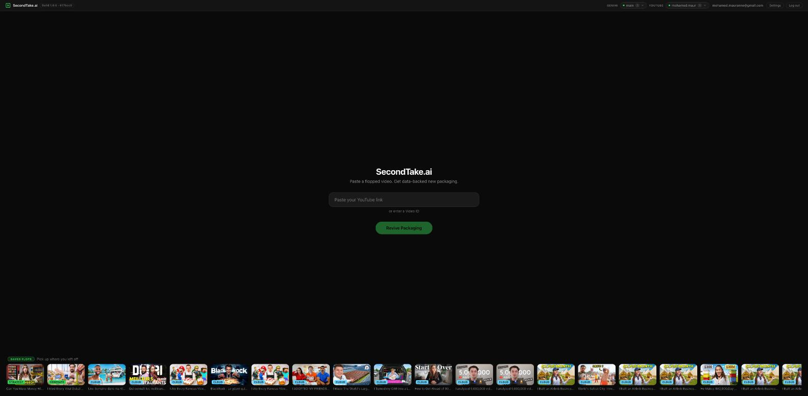

Paste a link, add your API keys, and pick up where you left off with saved flops.

### Video Analysis — Performance Stats
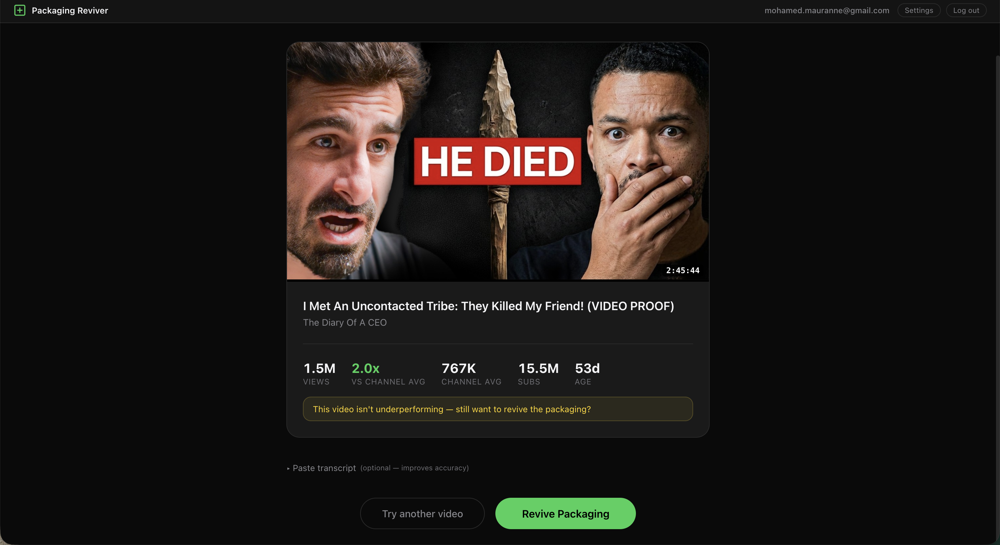

Pulls video stats from YouTube API. Shows views, channel average, subscriber count, and age. Flags whether it's actually underperforming before you waste time reviving it.

### Transcript Paste + Key Topic Extraction
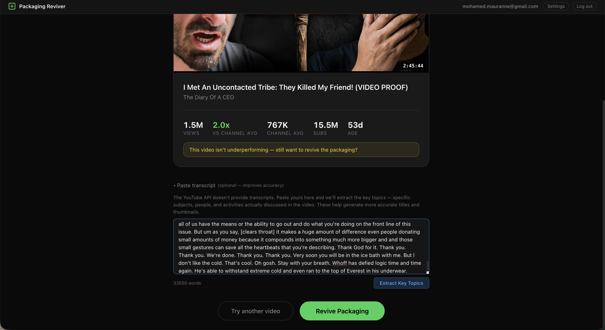

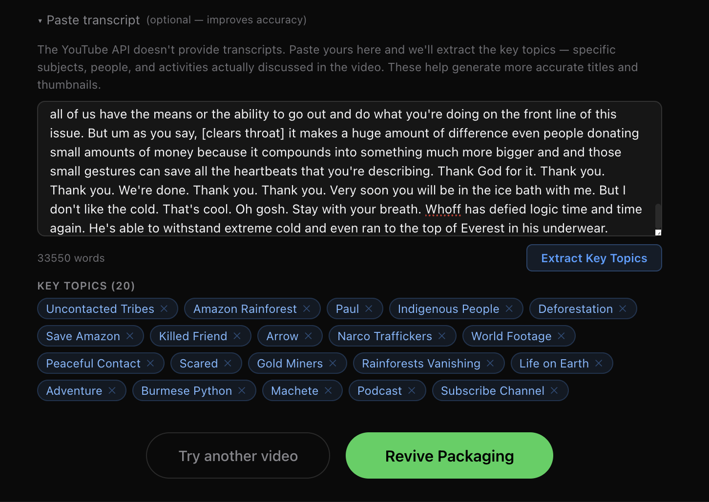

Paste the transcript (YouTube API doesn't provide it). AI extracts 20 key topics — these feed into smarter seed queries for the outlier research phase.

### Seed Queries — Expand, Narrow, Remove
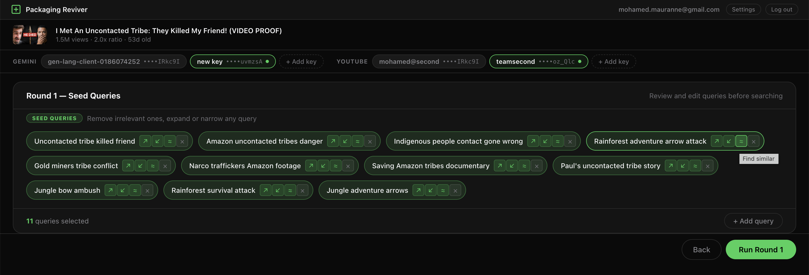

Each query has expand/narrow/similar controls. 11 queries selected for this run.

### Round 1 — Outlier Results
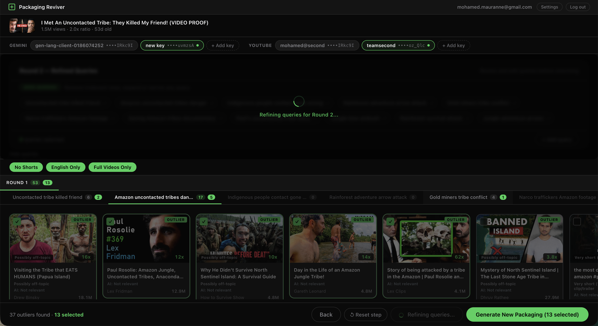

37 outliers found across the first round. Filter by No Shorts, English Only, Full Videos Only. Select the best ones to refine.

### Round 2 — Refined Results
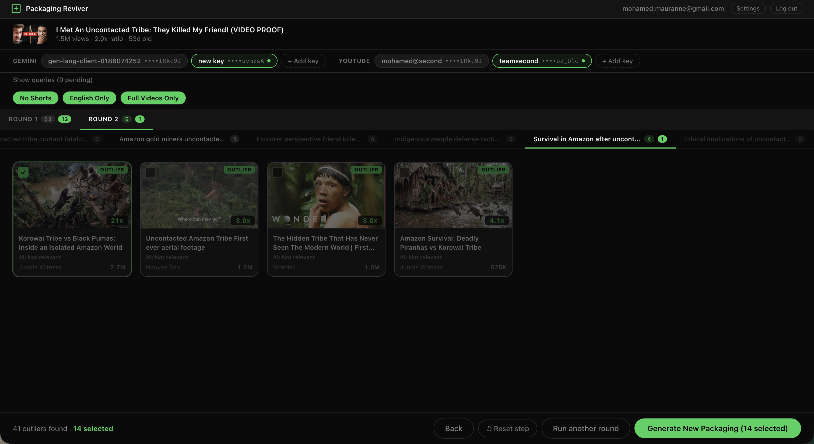

Second round narrows in. 41 outliers total, 14 selected for packaging generation.

### Diagnosis — What's Working vs What Needs Fixing
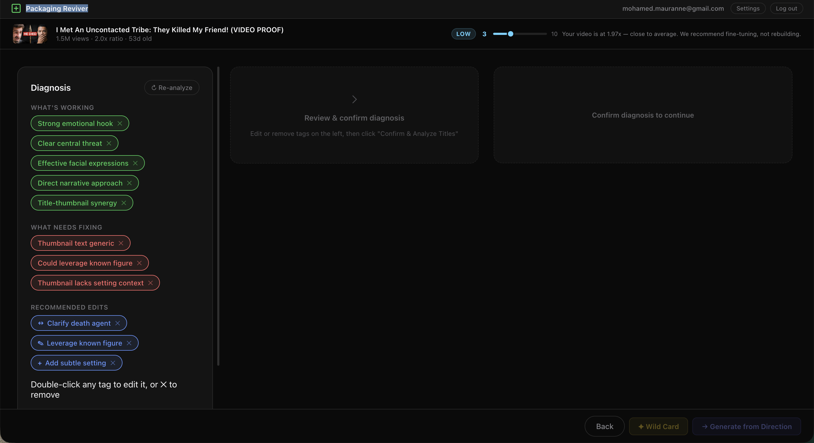

AI diagnosis with editable tags. Green = working (strong emotional hook, clear central threat). Red = needs fixing (thumbnail text generic, could leverage known figure). Blue = recommended edits.

### Title Analysis + Packaging Directions
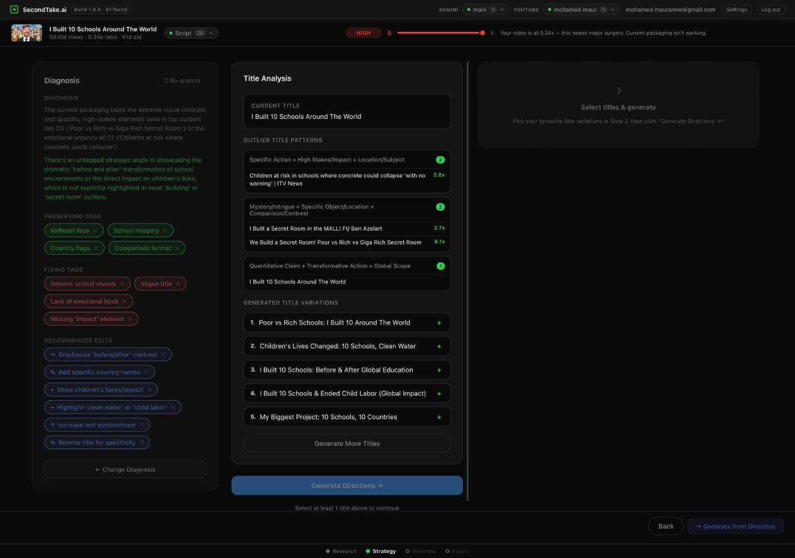

Detects outlier title patterns, generates 5 new title variations, and creates packaging directions — each with a new title, reference thumbnails, and specific edit instructions.

### Recommended Directions with Reference Thumbnails
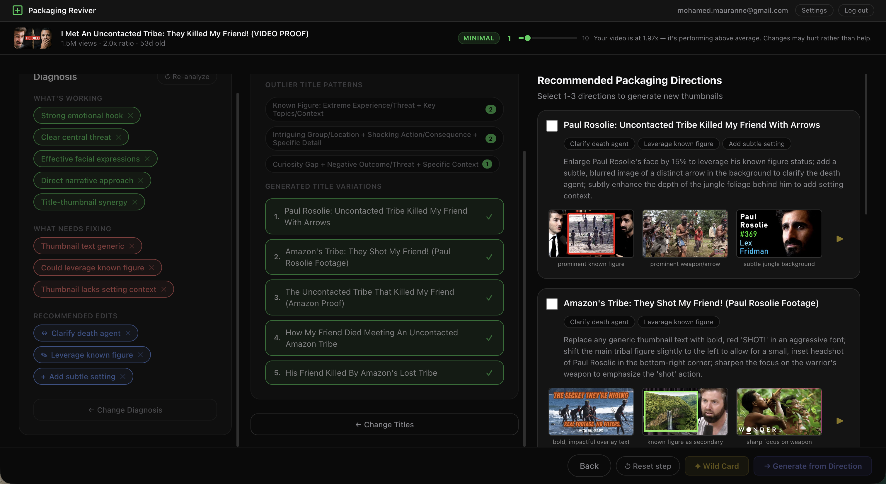

Each direction comes with thumbnail reference images from the outliers and specific visual instructions.

### Direction Tabs — Generate New Thumbnails
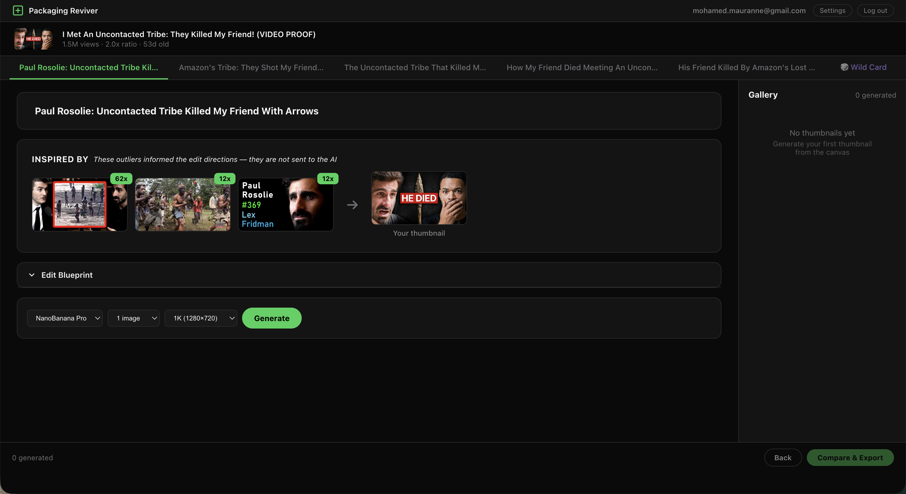

Each title direction gets its own tab. Select references, hit Generate, and the AI creates a new thumbnail informed by the edit directions.

### Generated Thumbnail with Gallery
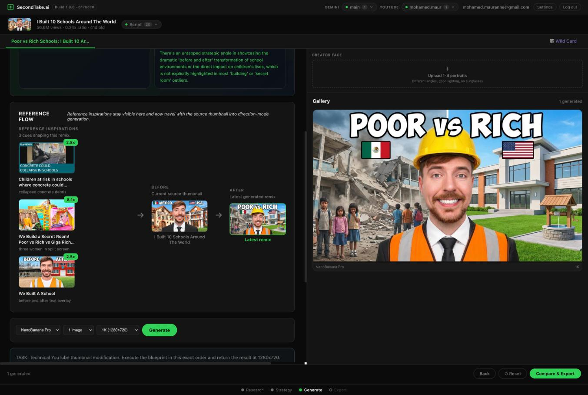

Generated thumbnail appears alongside the original. Compare the "before" reference against the "latest" generation.

### Wild Card Mode
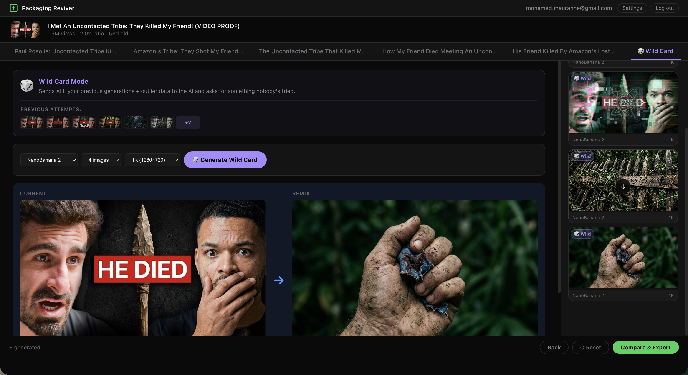

Sends all your previous generations + outlier data to the AI and asks for something nobody tried. Current vs remix shown side by side.

### Compare & Export — Original vs New Packaging
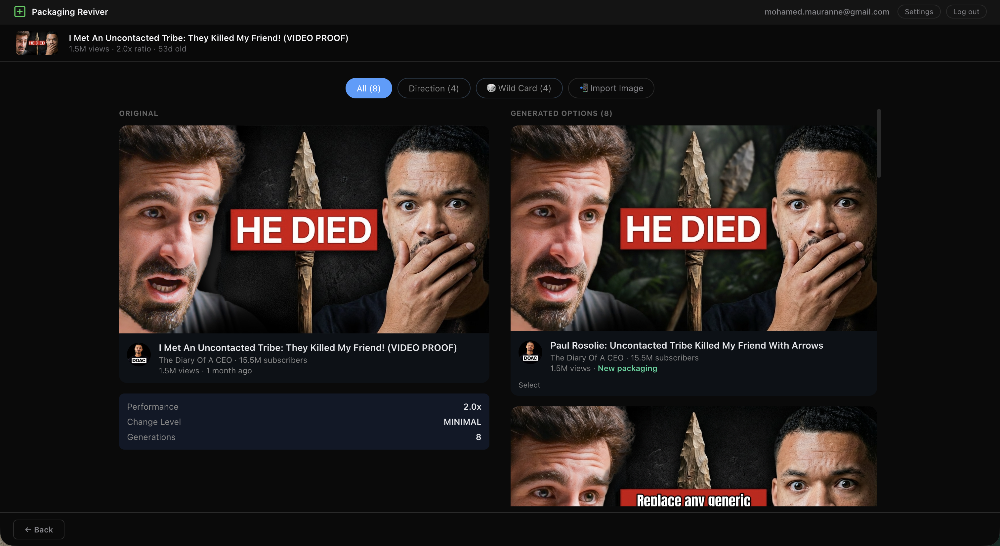

Side-by-side comparison of original and new packaging. Filter by Direction or Wild Card. Select the best ones.

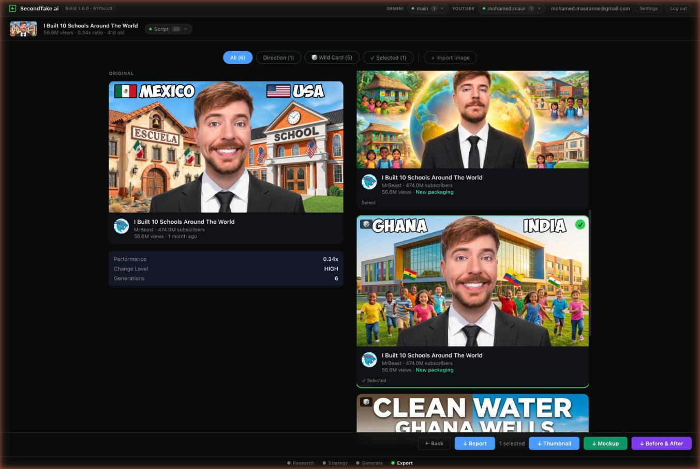

Export as Thumbnail, Mockup, or Before & After.

### Before & After
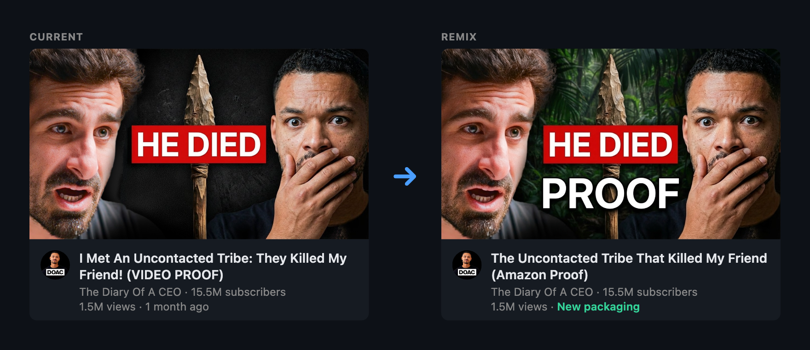

---

## Try It

**Live app:** [packaging-reviver.netlify.app](https://packaging-reviver.netlify.app)

The app is free to use but runs on your own API keys. After signing in, go to Settings and add:

1. **Gemini API key** — Go to [Google AI Studio](https://aistudio.google.com/apikey) and create a key. Used for diagnosis, title generation, packaging directions, and thumbnail generation. Free tier is generous.

2. **YouTube Data API v3 key** — Go to [Google Cloud Console](https://console.cloud.google.com/apis/credentials), create a project, enable the YouTube Data API v3, and generate an API key. Used to pull video stats and find outliers. Free tier gives you 10,000 quota units/day.

Your keys are encrypted client-side (AES-256-GCM) before storage. They never touch the server unencrypted.

---

## Why This Exists

Video packaging—title, thumbnail, hooks—is responsible for 80% of view count variance. A video that flopped isn't always bad content; it's often bad packaging.

This is the third evolution of the research-and-generate tools. **Version 1** was a monolithic HTML file (YouTube Outlier Research). **Version 2** added thumbnail generation (Thumbnail Studio). **Version 3** (this) unified them into a proper SvelteKit app with server-side key management, type-safe state, and a clear 5-screen user journey.

The pipeline works like this: paste a flopped video → Snowball research finds what wins in that niche → vision analysis identifies thumbnail patterns from winners → decomposes your original thumbnail into layers (background, text, graphics, brand) → "Change Dial" system calibrates edit intensity based on underperformance ratio → Gemini generates polished new thumbnails → side-by-side comparison with CTR prediction.

Instead of guessing what to change, creators get data-backed direction: "Increase contrast by 40%", "Reposition text to upper-left", "Use warmer colors."

## Technical Architecture

### Stack

| Layer | Tech |
|-------|------|
| **Frontend** | SvelteKit with Svelte 5 runes + TypeScript |
| **Backend** | Netlify Edge Functions (SvelteKit server routes) |
| **Database** | Neon PostgreSQL (projects, research cache, versions) |
| **AI Query Gen** | Gemini 2.5 Flash (research queries) |
| **AI Image Gen** | Gemini 2.0 (thumbnail generation) |
| **AI Vision** | Gemini Multimodal (pattern extraction, CTR scoring) |
| **Image Processing** | @imgly/background-removal (WASM, client-side) |
| **Auth** | JWT with HttpOnly cookies |
| **Encryption** | AES-256-GCM for API keys |
| **Persistence** | IndexedDB (local cache) + Neon (persistent) |

### Data Flow

```
User pastes flopped video URL
    ↓
Extract video metadata (YouTube API)
    ↓
Run Snowball research in that niche
    ↓
Vision analysis on winner thumbnails
    ↓
Extract patterns (color palettes, text positions, imagery style)
    ↓
Decompose user's original thumbnail into layers
    ↓
"Change Dial" calibrates intensity (underperformance ratio → edit magnitude)
    ↓
Generate 4 new thumbnail options via Gemini
    ↓
Vision model scores each new thumbnail + original
    ↓
Side-by-side comparison with CTR predictions
    ↓
User previews changes, decides to apply
```

### Key Technical Decisions

- **SvelteKit for v3**: The monolithic approach didn't scale. SvelteKit's server-side rendering, form actions, and layout system provide structure. Svelte 5 runes make state management clean.
- **Server-side Gemini proxy**: API keys live server-side only. Frontend never sees them. All sensitive API calls (Gemini, YouTube) go through server routes. This eliminates a whole class of leaks.
- **Client-side WASM image processing**: @imgly/background-removal runs in the browser—no server round-trip. Deconstructing thumbnails into layers happens locally for instant feedback.
- **"Change Dial" system**: Instead of "generate random variations," we calibrate edit intensity proportionally. If your video got 10% of expected views, we edit more aggressively. If 70%, subtle tweaks. Dial ranges 0-100.
- **4-strategy JSON repair chain**: Gemini sometimes returns malformed JSON (trailing commas, missing quotes). We have a fallback chain: (1) JSON.parse raw, (2) regex fix common errors, (3) extract JSON from markdown blocks, (4) manual parsing. Ensures robustness.
- **IndexedDB + Neon hybrid persistence**: Large binary assets (generated thumbnails) stay in IndexedDB for speed. Metadata and version history live in Neon.

## Security & Resilience

- **Magic-link passwordless auth**: No passwords. Tokens sent via email.
- **Server-side API key management**: Gemini, YouTube, and Resend keys live on the server. Frontend never touches them.
- **AES-256-GCM encrypted key storage**: API keys encrypted in the database with a derived key from the user's magic-link secret.
- **JWT with HttpOnly cookies**: Session tokens are secure against XSS and CSRF.
- **YouTube API quota rotation**: If researching in a niche requires multiple searches, keys rotate to avoid quota exhaustion.
- **4-strategy JSON repair chain**: Malformed Gemini responses don't crash. Fallback parsing keeps the pipeline running.
- **Version history immutability**: All thumbnail versions saved in Neon. Users can revert changes or compare iterations.
- **IndexedDB offline caching**: Generated images stay local until synced. Network failures don't lose work-in-progress.

## Project Structure

```
packaging-reviver/
├── src/routes/         # SvelteKit pages — research, strategy, generate, compare
├── src/lib/            # Stores, components, server-side API, utilities
├── schema.sql          # PostgreSQL schema
├── svelte.config.js
├── vite.config.js
├── package.json
└── README.md
```

## About the Author

**Mohamed** — Dubai-based YouTube creator and content strategist. My channel revolves around real-life challenges that reveal the true Dubai. I'm not a developer by training — I build tools because I need them, then clean them up enough to ship publicly.

Packaging Reviver started as a private workflow. It's now the system I use to evaluate whether a video concept is packaged well enough to click on.

- [YouTube](https://youtube.com/@mohamed_yaz)
- [LinkedIn](https://linkedin.com/in/momaurane)
- [GitHub](https://github.com/momaurane)
