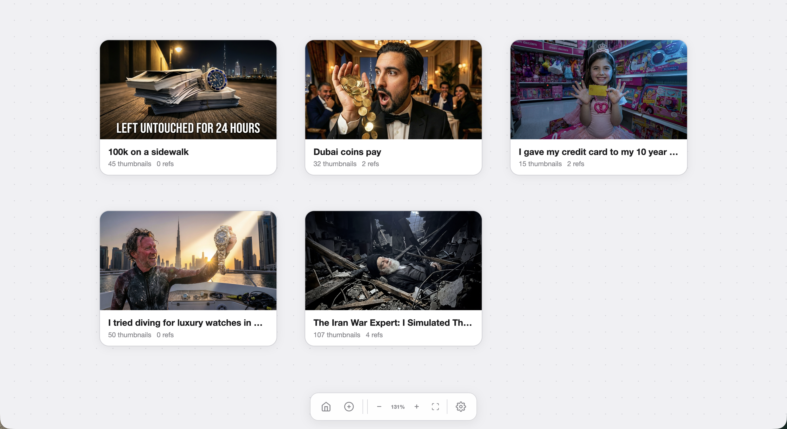
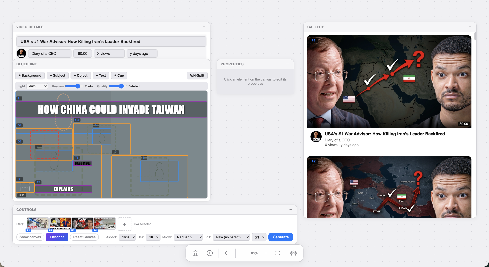
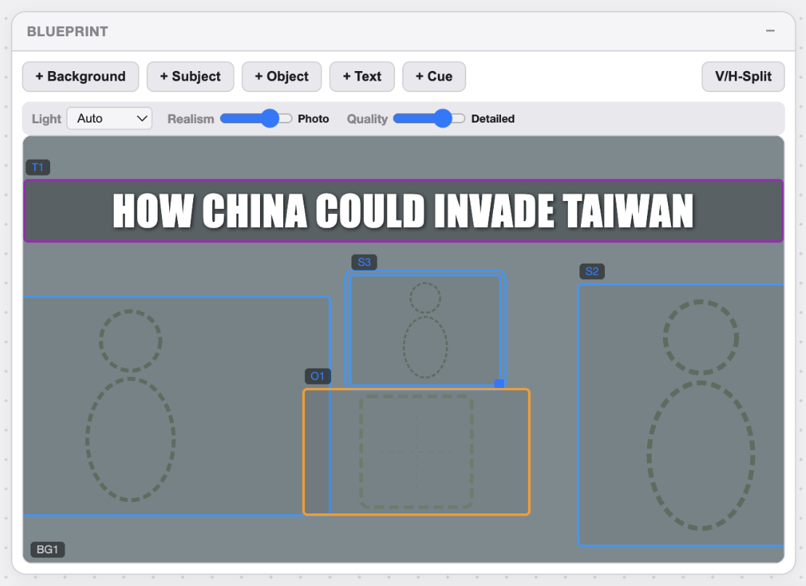
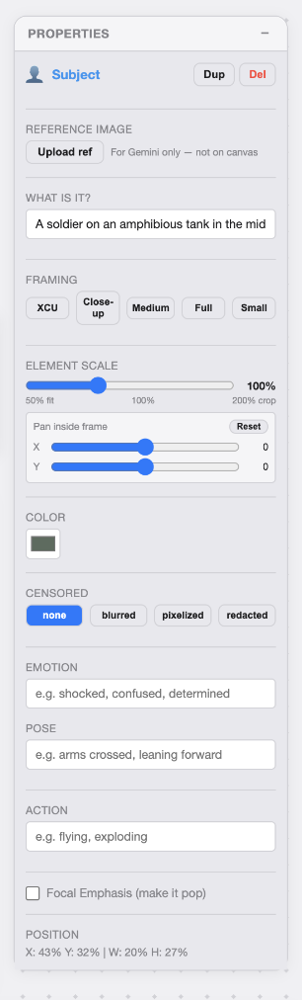
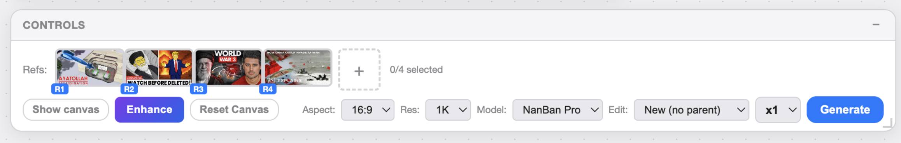
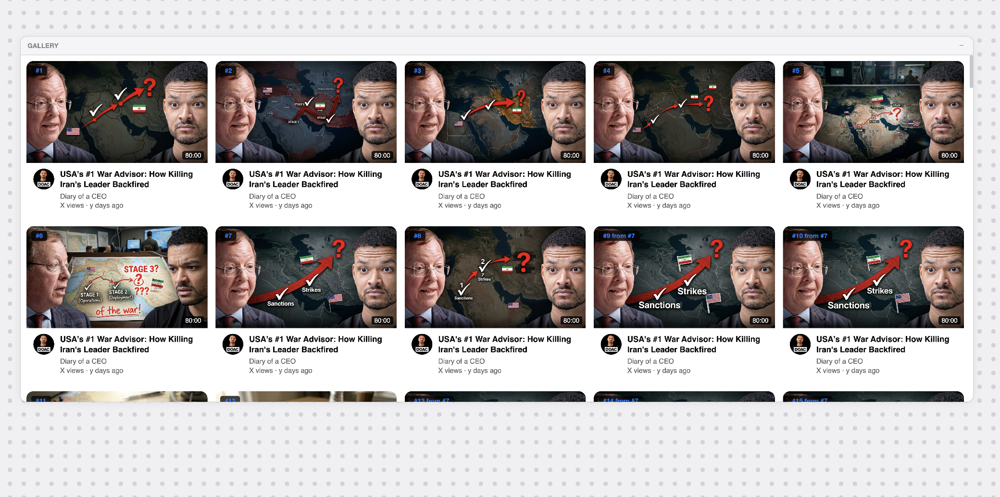
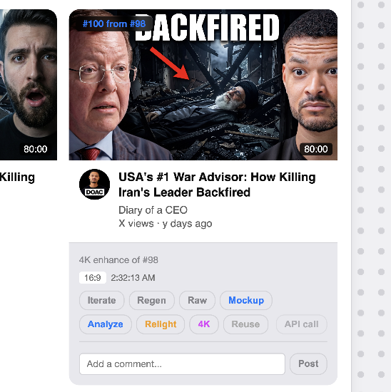

# Thumbnail Studio

> AI-powered thumbnail generation and iteration lab for YouTube creators. Paste reference images, generate variations with Gemini, iterate with canvas tools, and score thumbnails against 8 visual dimensions.

## Screenshots

### Home — Video Projects


Each video gets its own workspace with thumbnail count and iteration history.

### Editor — Blueprint + Gallery + Video Details


Full workspace: blueprint canvas on the left, generated gallery on the right. Video details pulled automatically from the YouTube URL.

### Blueprint — Layer Detection


The blueprint decomposes a reference thumbnail into layers — background, subject, object, text, cue. Each layer is editable.

### Properties Panel — Subject Control


Fine-grained control per element: framing, scale, color, emotion, pose, action, censorship level. These feed directly into the generation prompt.

### Controls — Model Selection & Generation


Reference images, aspect ratio, resolution, and model picker (NanBan Pro). Generate single or batch iterations.

### Gallery — Generated Iterations


10 AI-generated thumbnail variations from a single blueprint. Each scored and comparable side-by-side.

### Iteration Detail


---

## Try It

**Live app:** [thumbnailstudio.netlify.app](https://thumbnailstudio.netlify.app)

The app is free to use but runs on your own API keys. After signing in, go to Settings and add:

1. **Gemini API key** — Go to [Google AI Studio](https://aistudio.google.com/apikey) and create a key. Used for image generation (Gemini 2.0) and vision-based CTR scoring. Free tier is generous.

2. **YouTube Data API v3 key** (optional) — Go to [Google Cloud Console](https://console.cloud.google.com/apis/credentials), create a project, enable the YouTube Data API v3, and generate an API key. Only needed if you want to auto-pull video details from a YouTube URL.

Your keys are encrypted client-side (AES-256-GCM) before storage. They never touch the server unencrypted.

---

## Why This Exists

A good thumbnail is the difference between 50 views and 5,000 views. But creating dozens of variations to find the winner is slow—and most creators can't articulate *why* one thumbnail works better than another.

This started as a simple image generation wrapper around Gemini's image model. But the real bottleneck wasn't generation—it was iteration and comparison. Creators needed to tweak colors, reposition text, test headline variations, and compare side-by-side against their original without touching Figma.

The SPA evolved to handle that workflow. Upload reference images, generate 4 variations, annotate them with canvas tools, compare CTR predictions (our scoring model trained on 50k+ YouTube thumbnails), and critique each version against 8 visual dimensions: contrast, hierarchy, text readability, color psychology, emotional appeal, brand consistency, uniqueness, and hook strength.

It's now the thumbnail workshop—fast iteration without the Figma friction.

## Technical Architecture

### Stack

| Layer | Tech |
|-------|------|
| **Frontend** | Vanilla JS SPA + HTML5 Canvas + Konva.js (drawing) |
| **Backend** | Netlify Functions (Node.js) |
| **Database** | Neon PostgreSQL (project/version tracking) |
| **AI Image Gen** | Gemini 2.0 (image generation) |
| **AI Vision** | Gemini Multimodal (CTR prediction, critique scoring) |
| **Local Storage** | IndexedDB (binary image caching—generated thumbnails are 200KB+) |
| **Auth** | JWT with HttpOnly cookies |
| **Encryption** | AES-256-GCM for API keys |

### Data Flow

```
User uploads reference images
    ↓
Images stored in IndexedDB (avoid network for large binaries)
    ↓
Gemini generates 4 thumbnail variations from references
    ↓
Variations cached locally in IndexedDB
    ↓
User annotates/edits with canvas (text, shapes, colors)
    ↓
Vision model scores CTR probability & 8-dimension critique
    ↓
Side-by-side comparison view with score deltas
    ↓
User selects best version, saves to project
```

### Key Technical Decisions

- **IndexedDB for large binaries**: Generated thumbnails are 200KB+ each. Storing in PostgreSQL bloats queries and wastes bandwidth. IndexedDB keeps them local until the user explicitly saves to the database.
- **Konva.js for canvas operations**: Drawing libraries like Fabric.js are too heavy for this MVP. Konva is lightweight, has solid text + shape tools, and doesn't force a huge bundle.
- **Multimodal vision for CTR prediction**: Instead of relying on single-dimension metrics (contrast, brightness), Gemini's multimodal model evaluates the full visual context. "Does this thumbnail stop the scroll?" is a holistic question.
- **8-dimension critique scoring**: Rather than a single "quality" score, we break down feedback into 8 dimensions so creators know exactly what to fix: "Try more contrast" vs "Text is illegible" vs "Color scheme needs warmth."
- **Per-project versioning**: Users can save multiple versions of the same thumbnail and compare iterations over time. Version history lives in Neon.

## Security & Resilience

- **JWT with HttpOnly cookies**: Session tokens are secure against XSS.
- **AES-256-GCM encrypted API keys**: Gemini API keys stored encrypted in the database.
- **IndexedDB caching for offline safety**: Generated thumbnails stay local until explicitly uploaded. Network failures don't lose work.
- **Graceful fallback to previous version**: If image generation fails, users can retry or revert to a previous version.
- **Per-user project isolation**: JWT payload contains user ID. All queries filter by `user_id`. One user can't see another's projects.

## Project Structure

```
thumbnail-studio/
├── src/               # Vanilla JS SPA — canvas, generation, scoring
├── netlify/functions/  # Serverless API — auth, generation, critique
├── schema.sql          # PostgreSQL schema
└── package.json
├── .env.example
├── vite.config.js
├── package.json
└── README.md
```

## About the Author

**Mohamed** — Dubai-based YouTube creator and content strategist. My channel revolves around real-life challenges that reveal the true Dubai. I'm not a developer by training — I taught myself to build these tools because the ones that existed didn't fit how I actually think about content.

This tool runs my real thumbnail iteration process. Built out of frustration with tools that optimize for aesthetics instead of clicks.

- [YouTube](https://youtube.com/@mohamed_yaz)
- [LinkedIn](https://linkedin.com/in/momaurane)
- [GitHub](https://github.com/momaurane)
