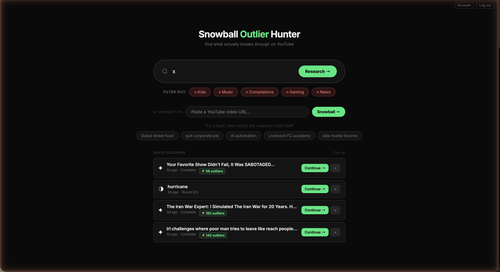
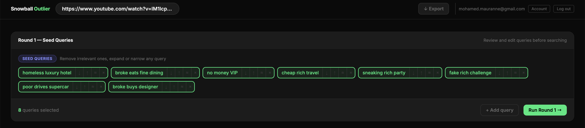
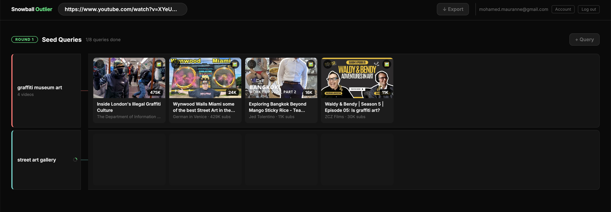
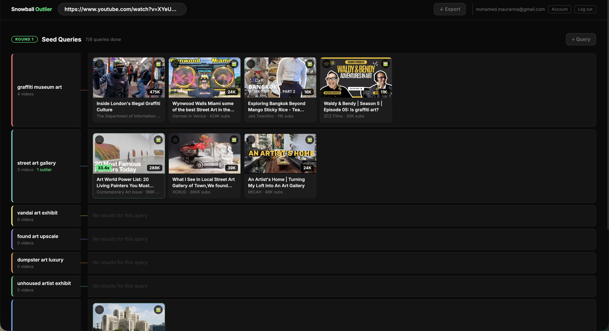
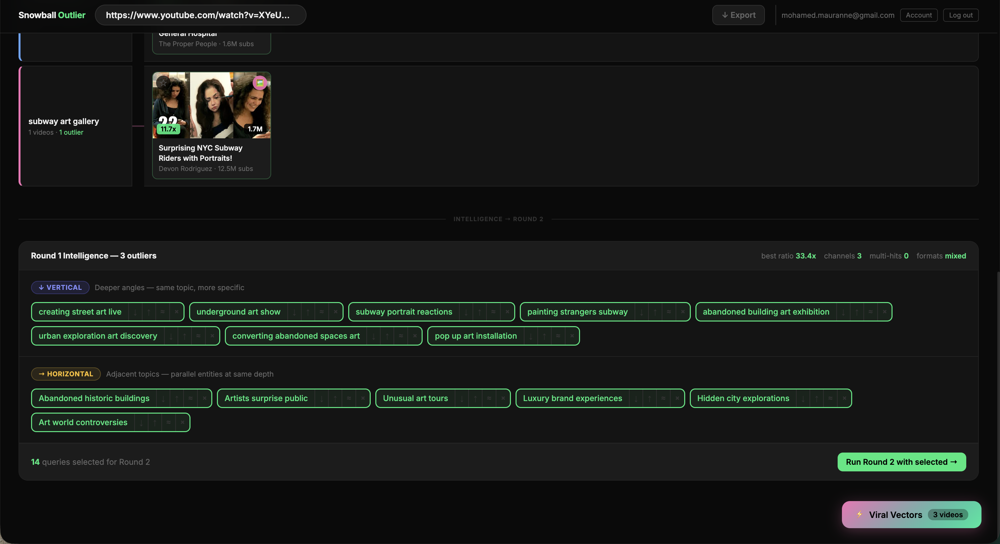
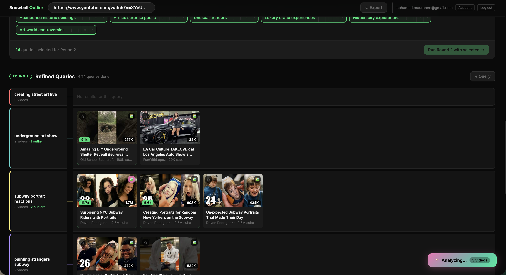
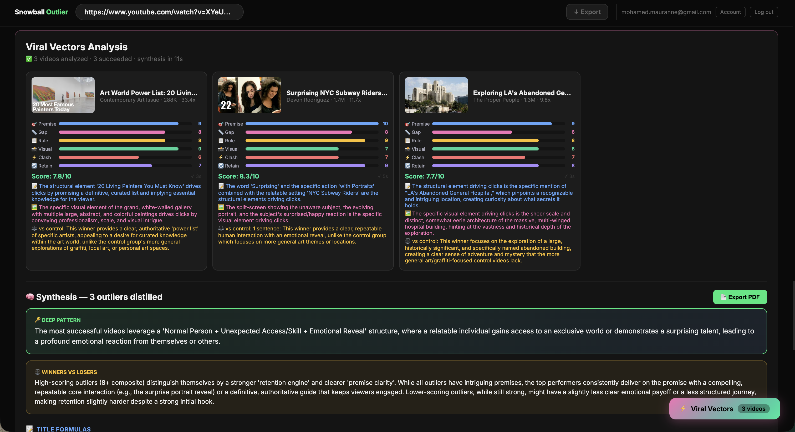
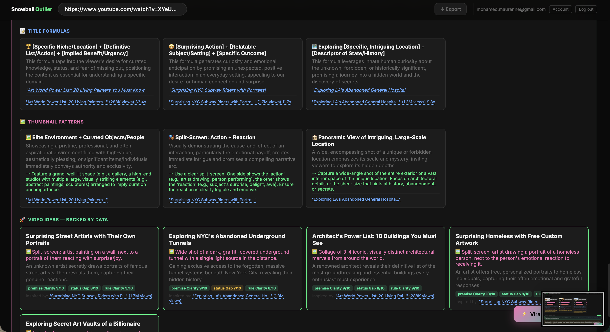
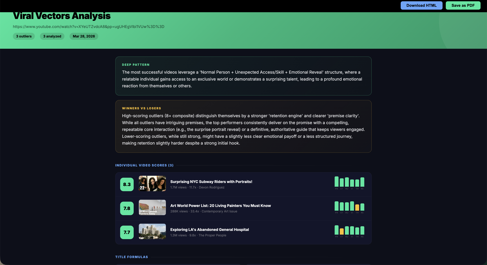

# YouTube Outlier Research

> Multi-round snowball research that finds what actually works on YouTube. Paste a topic, let the algorithm hunt for statistical outliers, then iterate through refined queries to surface winning content patterns.

## Screenshots

### Home — Saved Research Sessions


### Round 1 — AI-Generated Seed Queries


Queries are editable — remove irrelevant ones, expand, or narrow before searching.

### Round 1 — Video Results Grid




### Round 1 Intelligence — Refined Queries for Round 2


The algorithm analyzes Round 1 outliers and generates vertical (deeper) and horizontal (broader) queries for the next round.

### Round 2 — Refined Results


### Viral Vectors Analysis


Scores each outlier on packaging, retention engine, and premise clarity — then distills what separates winners from losers.

### Synthesis — Title Formulas, Thumbnail Patterns, Video Ideas


Data-backed content ideas generated from the patterns found across all rounds.

### Export — PDF & HTML


---

## Try It

**Live app:** [youtube-outlier-research.netlify.app](https://youtube-outlier-research.netlify.app)

The app is free to use but runs on your own API keys. After signing in, go to Settings and add:

1. **YouTube Data API v3 key** — Go to [Google Cloud Console](https://console.cloud.google.com/apis/credentials), create a project, enable the YouTube Data API v3, and generate an API key. Free tier gives you 10,000 quota units/day. You can add up to 8 keys for higher throughput.

2. **Gemini API key** — Go to [Google AI Studio](https://aistudio.google.com/apikey) and create a key. Gemini 2.5 Flash is used for seed query generation and thumbnail vision analysis. Free tier is generous.

Your keys are encrypted client-side (AES-256-GCM) before storage. They never touch the server unencrypted.

---

## Why This Exists

YouTube's success formula is hidden in the outliers — videos that perform 2x+ better than the channel average. Most creators chase trending topics without understanding *why* certain videos work. This tool was built in 3 days as an internal research pipeline before creating content.

The MVP solved a real problem: manually checking 50+ YouTube videos to find patterns is tedious and prone to confirmation bias. So I built a script that generated smart queries, searched systematically, flagged outliers, and extracted strategy insights. It worked. The script grew into a full SPA with multi-round refinement, API key rotation, and encrypted storage.

Today it's the research engine behind content decisions. Instead of guessing, you get data-backed insights: which titles resonate, which thumbnail patterns stick, which hooks work.

## Technical Architecture

### Stack

| Layer | Tech |
|-------|------|
| **Frontend** | Vanilla JS SPA (~3,400 lines) + HTML5 Canvas |
| **Backend** | Netlify Functions (Node.js) |
| **Database** | Neon PostgreSQL (serverless) |
| **AI** | Gemini 2.5 Flash (query generation + thumbnail vision analysis) |
| **External APIs** | YouTube Data API v3 (quota rotation across 8 keys) |
| **Auth** | Magic-link via Resend, JWT with HttpOnly cookies |
| **Encryption** | AES-256-GCM for API key storage |

### Data Flow

```
User Input (topic)
    ↓
Gemini 2.5 Flash generates 8 diverse search queries
    ↓
YouTube API searches videos in batches (quota-aware)
    ↓
Algorithm flags outliers (views > 2x channel average)
    ↓
Vision analysis on thumbnails (Gemini multimodal)
    ↓
Pattern extraction (titles, CTAs, color schemes)
    ↓
Refine queries based on winning patterns
    ↓
Repeat rounds 2-3 for deeper research
    ↓
Deliver top outliers with strategy insights
```

### Key Technical Decisions

- **Vanilla JS for v1**: No build step needed. Fast iteration. The 3-day MVP required speed over structure.
- **Gemini 2.5 Flash for query generation**: Small, fast, and accurate at producing diverse search queries that probe different audience angles.
- **Multi-key YouTube API quota rotation**: YouTube limits 10,000 quota units per day per key. With 8 API keys rotated strategically, we can search 8x more videos in a single session.
- **Client-side encrypted key storage**: API keys are AES-256-GCM encrypted with a derived key from the user's magic-link secret. Keys never touch unencrypted databases.
- **Multimodal vision analysis**: Gemini's image understanding lets us extract thumbnail design patterns programmatically instead of manual categorization.
- **2-round minimum refinement**: First round finds breadth, second round refines based on patterns found in round 1. A third round catches nuance.

## Security & Resilience

- **Magic-link passwordless auth**: No passwords stored. Each login generates a short-lived token sent via Resend email.
- **JWT with HttpOnly cookies**: Session tokens are HttpOnly, Secure, and SameSite=Strict. XSS can't steal them.
- **AES-256-GCM encrypted API key storage**: YouTube API keys are encrypted client-side with a key derived from the user's magic-link secret. Stored encrypted in the database.
- **YouTube API quota rotation**: 8 API keys are cycled across searches. If one key hits quota, the next search uses a different key. Tracks usage per key in real time.
- **Graceful API failure**: If Gemini is slow or quota is exhausted, the UI queues the search and retries with exponential backoff.
- **Search result caching**: Recent searches are cached in IndexedDB for offline access and to reduce redundant API calls.

## Project Structure

```
youtube-outlier-research/
├── src/               # Vanilla JS SPA — components, crypto, caching
├── netlify/functions/  # Serverless API — auth, search, encryption
├── schema.sql          # PostgreSQL schema
└── package.json
```

## About the Author

**Mohamed** — Dubai-based YouTube creator and content strategist. My channel revolves around real-life challenges that reveal the true Dubai. I'm not a developer by training — I taught myself to build these tools because the research workflows I needed didn't exist.

This tool runs my actual content pipeline. It's not a side project, it's infrastructure.

- [YouTube](https://youtube.com/@mohamed_yaz)
- [LinkedIn](https://linkedin.com/in/momaurane)
- [GitHub](https://github.com/momaurane)
